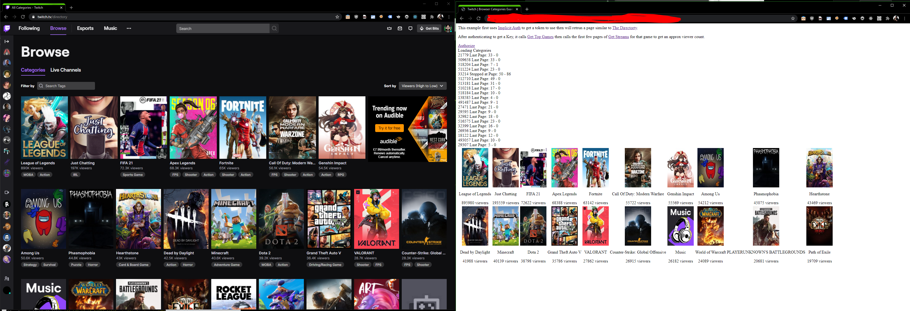

## What is this example

This is a very rough example of how to build a page which collects the data needed to generate [The Directory](https://www.twitch.tv/directory)

It uses Implicit auth to obtain a token, but this is just for the [GitHub pages demo](https://barrycarlyon.github.io/twitch_misc/examples/browse_categories/).

If you are building this yourself and as a "server" application, you can use any kind of token as it's all public data.

Normally for a server solution (you first wouldn't be doing it client side or with fetch), you'd normally use a [Client Credentaisl/App Access/Server to Server token](https://dev.twitch.tv/docs/authentication/getting-tokens-oauth#oauth-client-credentials-flow)

## TRY THIS EXAMPLE NOW!

This example is also available via GitHub Pages!

Give it a [whirl here](https://barrycarlyon.github.io/twitch_misc/examples/browse_categories/)

## Reference Documentation

- [OAuth Implicit Code Flow](https://dev.twitch.tv/docs/authentication/getting-tokens-oauth#oauth-implicit-code-flow)
- [Get Top Games](https://dev.twitch.tv/docs/api/reference#get-top-games)
- [Get Streams](https://dev.twitch.tv/docs/api/reference#get-streams) - Using GameID's to filter

## But what about rate limits?

This example runs in a browser and we are using implicit auth to get a token to use.
As a result we are using frontend JS to make the API calls, and browsers will limit the number of requests made to the same domain (api.twitch.tv in this example), so we can't "hammer" enough to get close to the rate limit.

But that is something to consider if you are making these calls server side.

## Setting up the config

- Visit [Twitch Dev Console](https://dev.twitch.tv/console/)
- Visit Applications
- Manage your Application, or create one if you don't have one
- Copy the Client ID into `client_id` JavaScript Variable
- You'll need to throw this webpage into a website somewhere, and update the `redirect` in the html file and on the dev console accordingly.

## Running the example

If you have PHP installed

> sudo php -S 127.0.0.1:80

or just throw the code up on a webpage somewhere

## Screenshot

