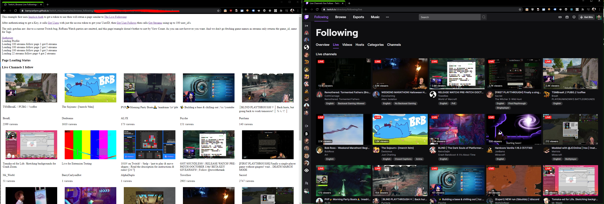

## What is this example

This is a very rough example of how to build a page which collects the data needed to generate [Live Following](https://www.twitch.tv/directory/following)

It uses Implicit auth to obtain a token, but this is just for the [GitHub pages demo](https://barrycarlyon.github.io/twitch_misc/examples/browse_following/).

If you are building this yourself and as a "server" application, you can use any kind of token as it's all public data. But you would need to have a way to get the users username (or ID) from the user (input field) or prompt the user to login and use a user access token, like this demo does with Implict auth.

The only gotchas are: due to a current Twitch bug, ReRuns/Watch parties are omitted, and this page/example doesn't bother to sort by View Count. As you can sort however you want. And we don't go fetching game names as streams only returns the game_id, same for Tags.

## TRY THIS EXAMPLE NOW!

This example is also available via GitHub Pages!

Give it a [whirl here](https://barrycarlyon.github.io/twitch_misc/examples/browse_following/)

## Reference Documentation

- [Get User Follows](https://dev.twitch.tv/docs/api/reference#get-users-follows)
- [Get Streams](https://dev.twitch.tv/docs/api/reference#get-streams) - Using up to 100 userID's to filter

## Setting up the config

- Visit [Twitch Dev Console](https://dev.twitch.tv/console/)
- Visit Applications
- Manage your Application, or create one if you don't have one
- Copy the Client ID into the `""` of `client_id`
- You'll need to throw this webpage into a website somewhere, and update the `redirect` in the html file and on the dev console accordingly.

## Running the example

If you have PHP installed

> sudo php -S 127.0.0.1:80

or just throw the code up on a webpage somewhere

## Screenshot

