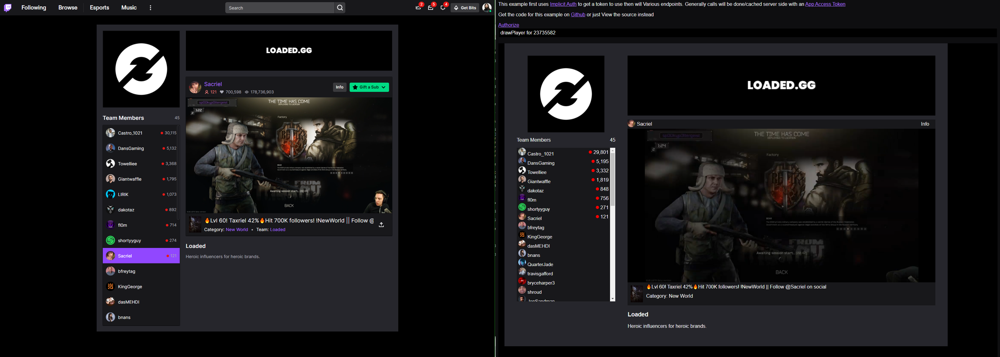

## What is this example

This is an example of using the API to do some things with "Team" data. In this example it's a royught copy of a Team Page from Twitch.

It uses Implicit auth to obtain a token, but this is just for the [GitHub pages demo](https://barrycarlyon.github.io/twitch_misc/examples/vod_player/).

If you are building this yourself and as a "server" application, you can use any kind of token as it's all public data.

## TRY THIS EXAMPLE NOW!

This example is also available via GitHub Pages!

Give it a [whirl here](https://barrycarlyon.github.io/twitch_misc/examples/team/)

## Reference Documentation

- [Embed Everything](https://dev.twitch.tv/docs/embed/everything)
- [Player JS API](https://dev.twitch.tv/docs/embed/video-and-clips#interactive-frames-for-live-streams-and-vods)
- [Get Team Information](https://dev.twitch.tv/docs/api/reference#get-teams)
- [Get Streams](https://dev.twitch.tv/docs/api/reference#get-streams)
- [Get Channel Information](https://dev.twitch.tv/docs/api/reference#get-channel-information)
- [Get Users (for user Lookup)](https://dev.twitch.tv/docs/api/reference#get-users)
- [Get Games (for game Boxart)](https://dev.twitch.tv/docs/api/reference#get-games)

## Setting up the config

- Visit [Twitch Dev Console](https://dev.twitch.tv/console/)
- Visit Applications
- Manage your Application, or create one if you don't have one
- Copy the Client ID into `client_id` JavaScript Variable
- You'll need to throw this webpage into a website somewhere, and update the `redirect` in the html file and on the dev console accordingly.

## Running the example

If you have PHP installed

> sudo php -S 127.0.0.1:80

or just throw the code up on a webpage somewhere

## Screenshot

This example will first load the "Loaded" team. Left is the ["Twitch" layout](https://www.twitch.tv/team/loadedllc) and right is the [output this example generates](https://barrycarlyon.github.io/twitch_misc/examples/team/).

