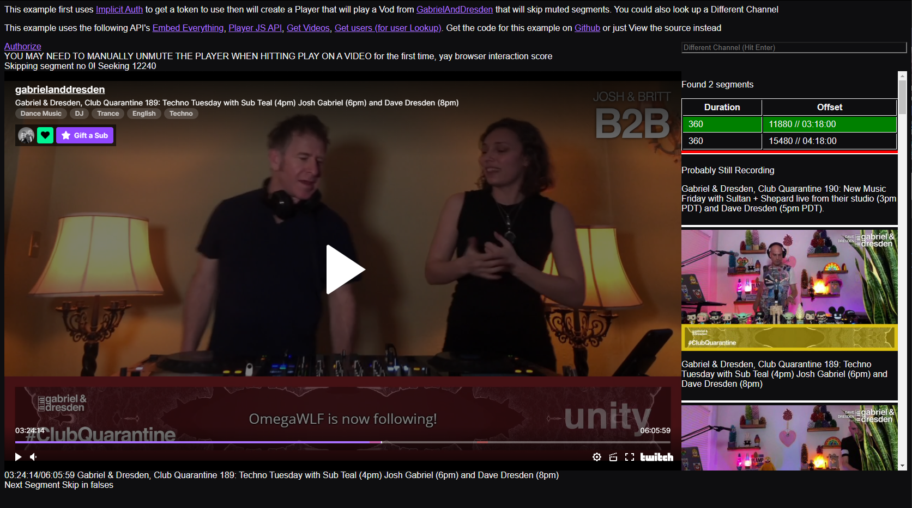

## What is this example

This is an example of a VOD player that will skip muted segments, now that the Get Videos API returns this data

It uses Implicit auth to obtain a token, but this is just for the [GitHub pages demo](https://barrycarlyon.github.io/twitch_misc/examples/vod_player/).

If you are building this yourself and as a "server" application, you can use any kind of token as it's all public data.

## TRY THIS EXAMPLE NOW!

This example is also available via GitHub Pages!

Give it a [whirl here](https://barrycarlyon.github.io/twitch_misc/examples/vod_player/)

## Reference Documentation

- [Embed Everything](https://dev.twitch.tv/docs/embed/everything)
- [Player JS API](https://dev.twitch.tv/docs/embed/video-and-clips#interactive-frames-for-live-streams-and-vods)
- [Get Videos](https://dev.twitch.tv/docs/api/reference#get-videos)
- [Get users (for user Lookup)](https://dev.twitch.tv/docs/api/reference#get-users)

## Setting up the config

- Visit [Twitch Dev Console](https://dev.twitch.tv/console/)
- Visit Applications
- Manage your Application, or create one if you don't have one
- Copy the Client ID into `client_id` JavaScript Variable
- You'll need to throw this webpage into a website somewhere, and update the `redirect` in the html file and on the dev console accordingly.

## Running the example

If you have PHP installed

> sudo php -S 127.0.0.1:80

or just throw the code up on a webpage somewhere

## Screenshot

This shows a recent vod from GabrielAndDresden where the player (now paused for screenshot purposes) has skipped the first segment that is muted

