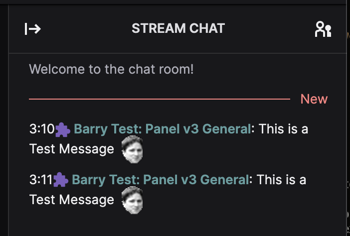

## What is this example

This example covers how to send an Extension Chat message with an Emote!

## Reference Documentation

- [Send Extension Chat Message](https://dev.twitch.tv/docs/api/reference#send-extension-chat-message);

## Setting up the config

- Open `config_sample.json` in a text editor
- Visit [Twitch Dev Console](https://dev.twitch.tv/console/)
- Visit Extensions
- Manage your Extension, or create one if you don't have any
- Top right select "Extension Settings"
- Copy the "Client ID" from the top into the `""` of `client_id`
- Down the bottom under `Extension Client Configuration` hit the `show` button
- Copy the contents of the field into the `""` of `extension_secret`
- Set the `""` of `owner` to the TwitchID of the user that owns the extension, usually this is you but it might not be
- Set the `""` of `channel_id` to the TwitchID of the channel that has the extension installed and active in a slot
- Set the `""` of `extension_version` to the version of the extension you wish to test. If does not have to be a released version. Just active on the target channel.
- Save your modified file as `config.json`

If is *important* that the `owner` and `channel_id` in the `config.json` is wrapped in `"`, as channelID's and userID's for extensions need to be cast as strings, not numerics.

## Setting up the extension

Make sure the Extension is ACTIVE in ANY slot in order to send Chat Messages.

## Running the example

In a console/terminal, run these commands:

- `npm install`
- `node send_chat.js`
